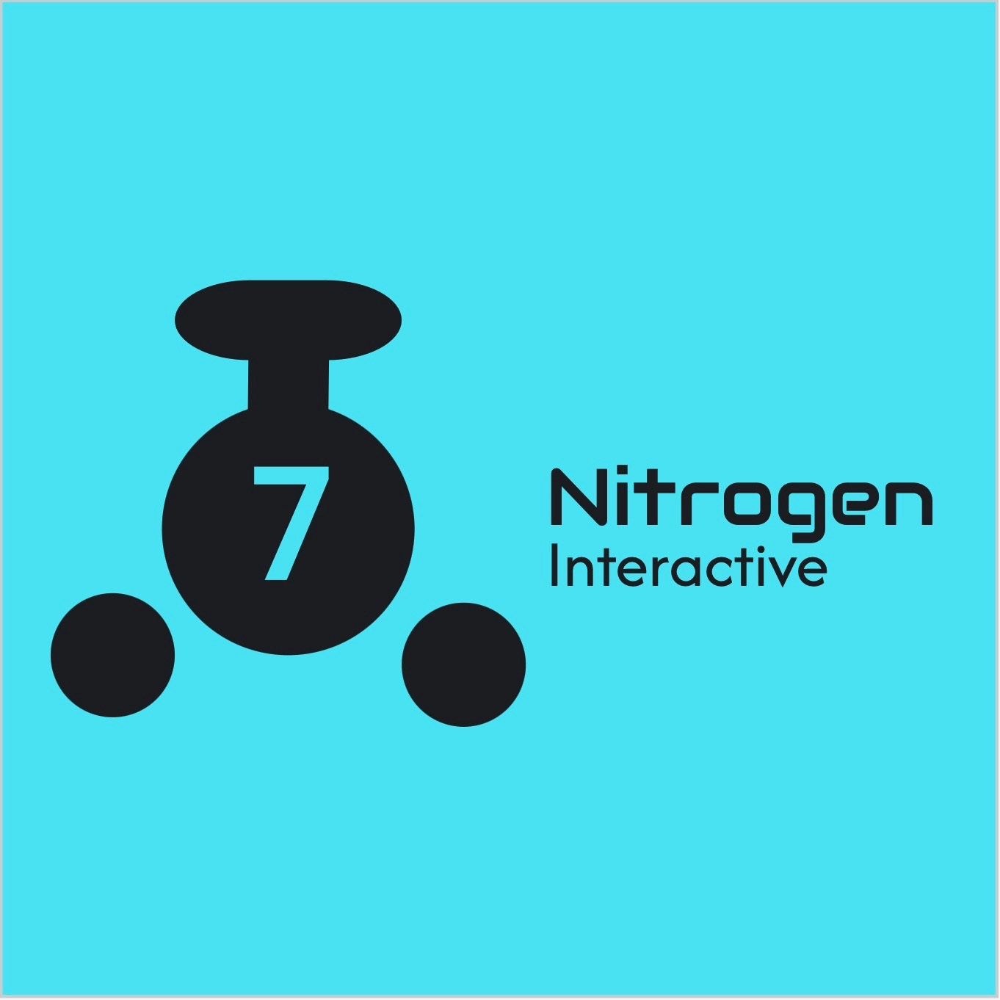

# CS 3383
CS 3383 Class Project

## GitHub Link
https://github.com/proph-et/uidaho-cs-3383-nitrogen-interactive

## Discord Link
https://discord.gg/2A5ut4xN3J

## Gantt Chart Link
[insert here]

## Team Leads
1) Andersen Westphal (git, IT stuff)  
2) Trevor DeVries (main programmer)  
2+) Yoshi Werner (secondary programmer)  
3) Eric Johnson (QA specialist)  
4) Haddie Meyer (project manager)  
5) Miles Kison (AI specialist)  
6) Torry Chmelik (version manager)

## Team Name
Nitrogen Interactive

## Team Logo

[temporary]

## Game Name
### Return of the Exiled: Where’s my sandwich?

## Game Concept
### Top down rpg 
+ class based combat
  + 3 classes
    + tank
    + support
    + dps
  + Skill tree
+ 3 maps
  + 2 enemies types per map
  + 1 large mini boss
  + 1 boss per map