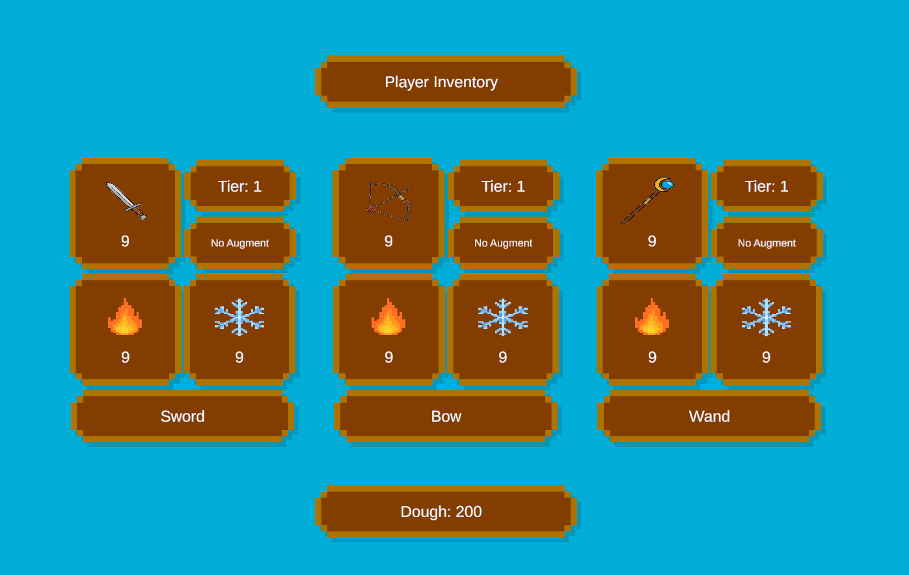

# ShopInterface Prefab

| Author: | Andersen Westphal |
| ------- | ----------------- |
| Price:  | free              |

## 1. Overview
The **ShopInterface** prefab is a preconfigured user interface that enables purchasing upgrades and augments for items.

- Purchase Weapon Upgrades  
- Purchase Weapon Fire Augments  
- Purchase Weapon Ice Augments  
- Remove Weapon Augments  

This document explains the structure of the prefab, the purpose of each component, and how other team members can safely modify or extend the player.

---

## 2. Purpose of This Prefab
This prefab contains everything needed to get a shop interface set up in game. 

It contains various buttons, images, and text 

Any scene that needs a shop interface should use *this prefab*, not a copy.

---

## 3. Required Components

### Shop.cs
Handles:
- Purchasing Actions

### Inventory.cs
Handles:
- Storing items and money

---

